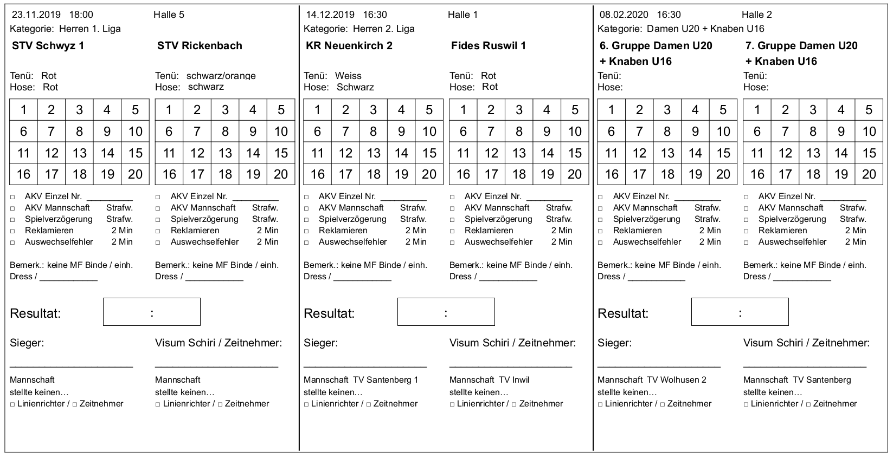

# Schirizettel Generator

### Screenshot

### Ausgabe

## Beschreibung

Diese Applikation hilft dir beim Erstellen von Korbball-Resultate-Zettel.
Als Voraussetzung muss Java ab der Version 8 installiert sein. Um die
Resultate-Zettel zu erstellen, lade das neuste Release hier herunter:
(https://github.com/romixch/SchirizettelGenerator/releases).
Entpacke die Zip-Datei und starte die Applikation im `bin`-Verzeichnis.

Ein Fenster öffnet sich. Darin kannst du folgende drei Dinge
auswählen:

- Vorlage:  Vorlage, wie die Zettel aussehen sollen. Ich habe bereits zwei Vorlagen erstellt. 
  Du kannst aber gerne deine eigene Vorlage erstellen. Beispiele findest du hier:
  [Vorlagen](https://github.com/romixch/SchirizettelGenerator/raw/master/src/main/resources/)
  Erstelle im Tool deiner Wahl einfach ein PDF-Formular, das dieser Generator dann ausfüllt. 
  Falls du hilfe dabei brauchst, meldest du dich bei der unten erwähnten Mail-Adresse.
- Daten:   Eine CSV-Datei, welche die zu druckenden Daten enthällt. Ein Beispiel dafür findest du auch hier:
  [BeispielDaten.csv](https://github.com/romixch/SchirizettelGenerator/raw/master/BeispielDaten.csv)
- Ausgabe: in diese PDF-Datei wird das Resultat geschrieben.

## Download

Gehe dazu in den [Relese-Bereich](https://github.com/romixch/SchirizettelGenerator/releases) von GitHub.

Für mehr Infos kontaktiere roman.schaller@gmail.com